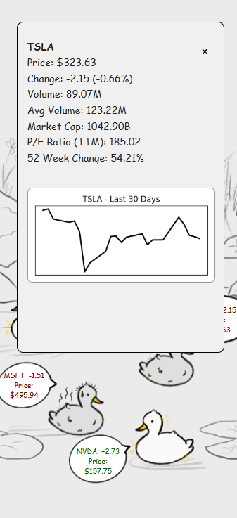

<h1>
  
  Quackfolio
</h1>


Quackfolio is a **stock portfolio companion** that helps you visualize your stock selections as adorable ducks floating in a pond.  
Each duck represents a stock ticker and reflects its recent market performance, good stocks with a clean duck, bad ones as dirty ducks.

---

### 🧠 What Does Quackfolio Do?

- **Add up to 5 stock tickers** from Yahoo Finance
- Ducks appear in your pond based on stock performance
- Click on each duck to view:
  - Price, change, percent change
  - Volume, Avg volume, Market Cap
  - P/E Ratio, 52 Week Change
  - A mini graph of the past month’s performance!

---

### 🛠️ How Is It Built?

- **Frontend**: HTML, CSS, JavaScript  
- **Backend**: Flask (Python)
- **APIs**: [yfinance](https://pypi.org/project/yfinance/) for live stock data  
- **Visualization**: Matplotlib (for 30-day line graphs)  
- **Design**: Mobile-first, custom duck art

---

### 🖼️ Preview

| Duck Pond View | Stock Detail Popup | Add Tickers | Search Page |
|----------------|--------------------|-------------|-------------|
|  |  |  |  |

---

### ✨ Inspired By

[Life of Gaurz – YouTube Channel](https://www.youtube.com/@lifeofgaurz/featured)

---

### 🚀 How to Run Locally

1. **Clone the repo**
   ```bash
    git clone https://github.com/your-username/quackfolio.git
    cd quackfolio
    python -m venv venv
    source venv/bin/activate     # On Windows: venv\Scripts\activate 
    pip install -r requirements.txt
    ```

2. Create .env file:
```bash
    cp .env.example .env
```
Open .env and set:
```bash
SECRET_KEY=your-very-secret-key

```
3. Run the app:

```bash
 python run.py
```

3. **Visit Site**

Open your browser and go to http://localhost:5000


🧡 Credits
Duck icons and background drawn by hand.  
Powered by open data from Yahoo Finance via yfinance.


